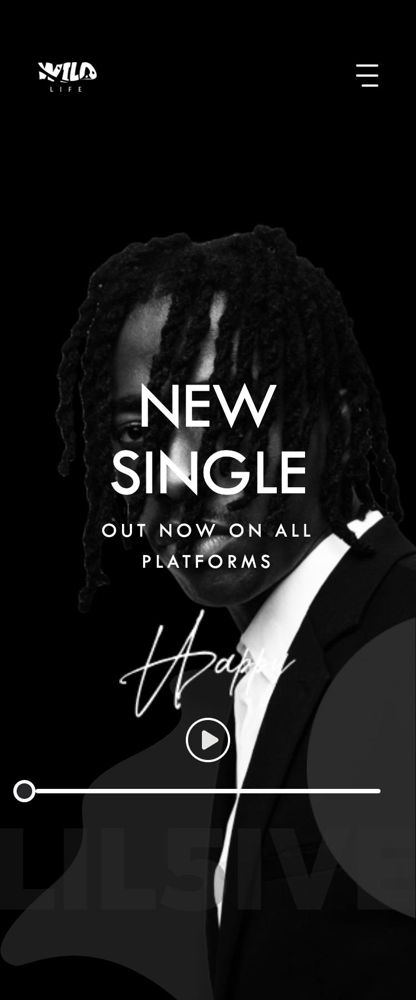
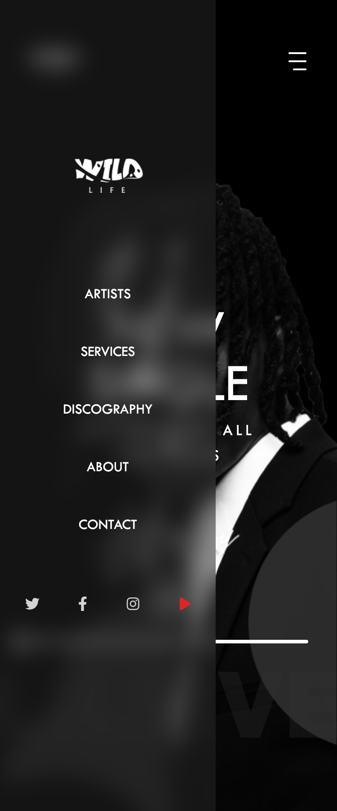
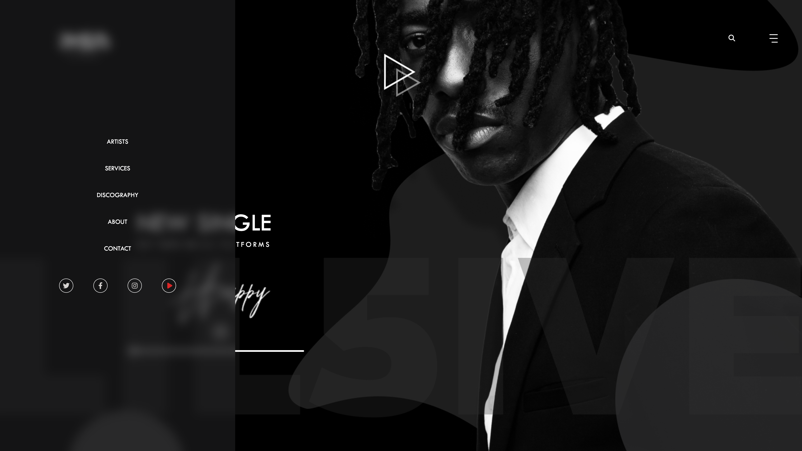

# WL Audio - An audio application 

This is the documentation for the WL Audio, an application that allows you to play audio.

## Table of Contents

- [Overview](#overview)
  - [Introduction](#introduction)
  - [Screenshot](#screenshot)
    - [Mobile](#mobile)
    - [Desktop](#desktop)
  - [Links](#links)
- [My Process](#my-process)
  - [Built With](#built-with)
- [Author](#author)

## Overview

### Introduction

WL Audio is a front-end application that allows you to play an embedded audio file on the website. The application includes a progress bar that updates in real-time to reflect the percentage of the audio being played.

### Screenshot

#### Mobile

   
   

#### Desktop

   
   

### Links
- GitHub: [https://github.com/Hikmahx/wl-audio](https://github.com/Hikmahx/wl-audio)
- Live Site URL: [https://wl-audio.vercel.app/](https://wl-audio.vercel.app/)

## My Process

### Built With

- React
- TypeScript
- Tailwind
- Redux Toolkit
- Font Awesome

## Author

- Github - [Hikmah Yousuph](https://github.com/Hikmahx)
- Email - [hikmayousuph@gmail.com](hikmayousuph@gmail.com)
- LinkedIn - [Hikmah Yousuph](linkedin.com/in/hikmah-yousuph-449467204/)